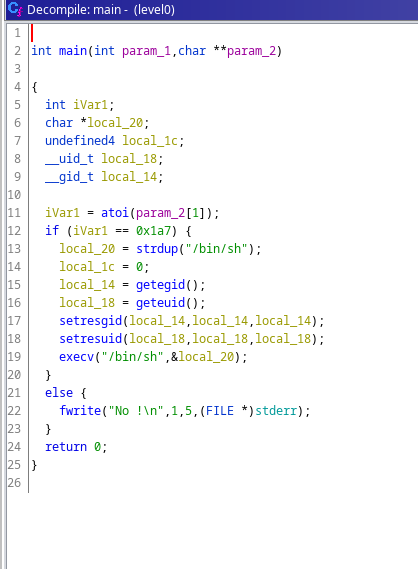

I have scp the level0 executable, then i used ghidra to decompile it.

Here is the result of decompilation:

the input string have to be equal to 0x1a7 (423)

So I just passed 423 has argument and it worked